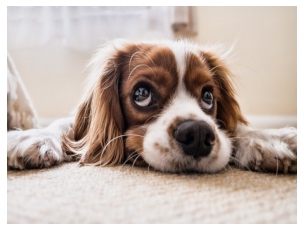

---
# 1.Opencv Intro
---
## 1.1. import할 것들


```python
#pip install opencv-python
import cv2
import numpy as np
import sys
#cv2.__version__
```

## 1.2. 이미지 파일불러오기
### 1.2.1 강아지


```python
img=cv2.imread('./fig/puppy.bmp', cv2.IMREAD_COLOR)
#cv2.IMREAD_COLOR, cv2.IMREAD_GRAYSCALE

if img is None:
    print('image read failed')
    sys.exit()

cv2.namedWindow('image')
cv2.imshow('image',img)

cv2.waitKey() #key 미사용시 애러       
cv2.destroyAllWindows()
```

    49
    

### 1.2.2. 내 파일에 적용


```python
img=cv2.imread('./fig/mokoko.jpg')

if img is None:
    print('image read failed')
    sys.exit()

cv2.namedWindow('image')
cv2.imshow('image',img)

cv2.waitKey() #key 미사용시 애러       
cv2.destroyAllWindows()
```

## 1.3. 이미지 크기 줄이기+저장하기
### 1.3.1. img


```python
img=cv2.imread('./fig/mokoko.jpg', cv2.IMREAD_REDUCED_GRAYSCALE_4)

if img is None:
    print('image read failed')
    sys.exit()

cv2.namedWindow('image')
cv2.imshow('image',img)

cv2.waitKey() #key 미사용시 애러       
cv2.destroyAllWindows()
```

### 1.3.2. resize / 저장하기


```python
img=cv2.imread('./fig/mokoko.jpg')

if img is None:
    print('image read failed')
    sys.exit()

img_re=cv2.resize(img,(320, 240), interpolation=cv2.INTER_AREA)

cv2.namedWindow('image')
cv2.namedWindow('image_re')

cv2.imshow('image',img)
cv2.imshow('image_re',img_re)

cv2.imwrite('mokoko_resize.png', img_re) #저장하기

cv2.waitKey() #key 미사용시 애러       
cv2.destroyAllWindows()
```

### 1.3.3. namedWindow


```python
img=cv2.imread('./fig/mokoko.jpg', cv2.IMREAD_COLOR)

if img is None:
    print('image read failed')
    sys.exit()

cv2.namedWindow('image', cv2.WINDOW_NORMAL)
cv2.moveWindow('image',0,200)
cv2.imshow('image',img)

cv2.waitKey() #key 미사용시 애러       
cv2.destroyAllWindows()
```

## 1.4. waitKey


```python
img=cv2.imread('./fig/puppy.bmp', cv2.IMREAD_COLOR)

if img is None:
    print('image read failed')
    sys.exit()

cv2.namedWindow('image')
cv2.imshow('image',img)

cv2.waitKey(3000)       
cv2.destroyAllWindows()
```


```python
img=cv2.imread('./fig/puppy.bmp', cv2.IMREAD_COLOR)

if img is None:
    print('image read failed')
    sys.exit()

cv2.namedWindow('image')
cv2.imshow('image',img)

key=cv2.waitKey(3000)
print(key)

cv2.destroyAllWindows()
```


```python
img=cv2.imread('./fig/puppy.bmp', cv2.IMREAD_COLOR)

if img is None:
    print('image read failed')
    sys.exit()

cv2.namedWindow('image')
cv2.imshow('image',img)

while True:
    if cv2.waitKey()==27: #아스키 코르 27(esc)가 글어오면 나가셈
        break

cv2.destroyAllWindows()
```


```python
img=cv2.imread('./fig/puppy.bmp', cv2.IMREAD_COLOR)

if img is None:
    print('image read failed')
    sys.exit()

cv2.namedWindow('image')
cv2.imshow('image',img)


while True:
    key=cv2.waitKey()
    if key==ord('q') or key==27: #q를 아스키 코드로 면환 시키는 법
        break 

cv2.destroyAllWindows()
```

## 1.5. matplotlib 라이브러리를 이용한 영상출력


```python
import matplotlib.pyplot as plt
```

### 1.5.1. 1개 출력


```python
img=cv2.imread('./fig/puppy.bmp', cv2.IMREAD_COLOR)
#BGR
if img is None:
    print('image read failed')
    sys.exit()

cv2.namedWindow('image')
cv2.imshow('image',img)

#RGB
imgRGB= cv2.cvtColor(img, cv2.COLOR_BGR2RGB)
plt.imshow(imgRGB)
plt.axis('off')
plt.show()

while True:
    if cv2.waitKey()==27: #아스키 코르 27(esc)가 글어오면 나가셈
        break

cv2.destroyAllWindows()
```


    

    


### 1.5.2. 여러개 출력


```python
## gray scale 영상으로 출력
imgGray = cv2.imread('fig/puppy.bmp', cv2.IMREAD_GRAYSCALE)

# plt.imshow(imgGray, cmap='gray')
# plt.axis('off')
# plt.show()

## 두 개의 영상을 모두 출력
imgBGR = cv2.imread('fig/puppy.bmp', cv2.IMREAD_COLOR)
imgRGB = cv2.cvtColor(imgBGR, cv2.COLOR_BGR2RGB)

# fig, axes = plt.subplots(1, 2)
# axes[0].imshow(imgRGB), axes[0].axis('off')
# axes[1].imshow(imgBGR), axes[1].axis('off')

plt.subplot(131), plt.imshow(imgBGR), plt.axis('off')
plt.subplot(132), plt.imshow(imgRGB), plt.axis('off')
plt.subplot(133), plt.imshow(imgGray, cmap = 'gray'), plt.axis('off')

plt.show()
```


    

    


## 1.6. 이미지 슬라이드 쇼


```python
import os
```

### 1.6.1. 반복X


```python
img_list=os.listdir('./fig/images/')
img_path=[]

for i in img_list:
    img_path_all='./fig/images/'+i
    img_path.append(img_path_all)

# # 전체 화면으로 'image' 창 생성
cv2.namedWindow('scene', cv2.WINDOW_NORMAL)
cv2.setWindowProperty('scene', cv2.WND_PROP_FULLSCREEN,
                    cv2.WINDOW_FULLSCREEN)

for i in img_path:
    img = cv2.imread(i)
    
    cv2.imshow('scene', img)
    
    if cv2.waitKey(1000) == 27:
        break
    
cv2.destroyAllWindows()
```

### 1.6.2. 반복O


```python
import sys
## Wild card
import glob
import cv2

img_files = glob.glob('fig/images/*.jpg')
    
# 전체 화면으로 'image' 창 생성
cv2.namedWindow('scene',cv2.WINDOW_NORMAL)
cv2.setWindowProperty('scene', cv2.WND_PROP_FULLSCREEN, cv2.WINDOW_FULLSCREEN)

cnt = len(img_files)
idx = 0

while True:
    img = cv2.imread(img_files[idx])
#     img = cv2.resize(img, dsize = (1920, 1080), interpolation = cv2.INTER_AREA)
    
    cv2.imshow('image', img)
    
    if cv2.waitKey(1000) == 27: #ESC
        break
    
    idx += 1
    if idx >= cnt:
        idx = 0
        
cv2.destroyAllWindows()
```
