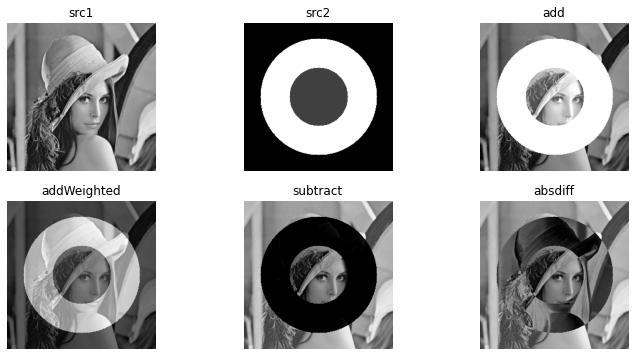
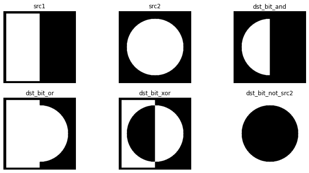

---
# 3. opencv_point_processing
---
## 3.1. 필요한것


```python
import numpy as np
import cv2
import sys
```

## 3.2.슬라이딩
### 3.2.1.흑백


```python
src=cv2.imread('./fig/lenna.bmp', cv2.IMREAD_GRAYSCALE)

if src is None:
    print('이미지가 없다요')
    sys.exit()
    
#dst=np.clip(src+100.,0,255).astype(np.unit8)
dst=cv2.add(src,100)

cv2.imshow('src',src)
cv2.imshow('dst',dst)

cv2.waitKey()
cv2.destroyAllWindows()
```

### 3.2.2.칼라


```python
src=cv2.imread('./fig/lenna.bmp', cv2.IMREAD_COLOR)

if src is None:
    print('이미지가 없다요')
    sys.exit()
    
#dst=np.clip(src+100.,0,255).astype(np.unit8)
dst=cv2.add(src,(100,100,100,0))

cv2.imshow('src',src)
cv2.imshow('dst',dst)

cv2.waitKey()
cv2.destroyAllWindows()
```

## 3.3. 산술연산


```python
import matplotlib.pyplot as plt

src1 = cv2.imread('fig/lenna256.bmp', cv2.IMREAD_GRAYSCALE)
src2 = np.zeros((256, 256), dtype = np.uint8)
cv2.circle(src2, (128, 128), 100, 200, -1)
cv2.circle(src2, (128, 128), 50, 50, -1)

if src1 is None or src2 is None:
    print('Image load failed!')
    sys.exit()

dst1 = cv2.add(src1, src2, dtype=cv2.CV_8U)
dst2 = cv2.addWeighted(src1, 0.5, src2, 0.5, 0.0)
dst3 = cv2.subtract(src1, src2)
dst4 = cv2.absdiff(src1, src2)

plt.figure(figsize = (12, 6))
plt.subplot(231), plt.axis('off'), plt.imshow(src1, 'gray'), plt.title('src1')
plt.subplot(232), plt.axis('off'), plt.imshow(src2, 'gray'), plt.title('src2')
plt.subplot(233), plt.axis('off'), plt.imshow(dst1, 'gray'), plt.title('add')
plt.subplot(234), plt.axis('off'), plt.imshow(dst2, 'gray'), plt.title('addWeighted')
plt.subplot(235), plt.axis('off'), plt.imshow(dst3, 'gray'), plt.title('subtract')
plt.subplot(236), plt.axis('off'), plt.imshow(dst4, 'gray'), plt.title('absdiff')
plt.show()
```


    

    


```python
src1 = np.zeros((256, 256), dtype = np.uint8)
# src1[10:246,10:127] = 255
cv2.rectangle(src1, (10, 10), (127, 248), 255, -1) 

src2 = np.zeros((256, 256), dtype = np.uint8)
cv2.circle(src2, (128, 128), 100, 255, -1)
# cv2.circle(src2, (128, 128), 50, 50, -1)

dst_bit_and= cv2.bitwise_and(src1, src2)
dst_bit_or= cv2.bitwise_or(src1, src2)
dst_bit_xor= cv2.bitwise_xor(src1, src2)
dst_bit_not= cv2.bitwise_not(src2)

plt.figure(figsize = (12, 6))
plt.subplot(231), plt.axis('off'), plt.imshow(src1, 'gray'), plt.title('src1')
plt.subplot(232), plt.axis('off'), plt.imshow(src2, 'gray'), plt.title('src2')
plt.subplot(233), plt.axis('off'), plt.imshow(dst_bit_and, 'gray'), plt.title('dst_bit_and')
plt.subplot(234), plt.axis('off'), plt.imshow(dst_bit_or, 'gray'), plt.title('dst_bit_or')
plt.subplot(235), plt.axis('off'), plt.imshow(dst_bit_xor, 'gray'), plt.title('dst_bit_xor')
plt.subplot(236), plt.axis('off'), plt.imshow(dst_bit_not, 'gray'), plt.title('dst_bit_not_src2')
plt.show()
```


    

    


## 3.4. 컬러영상


```python
# 컬러 영상 불러오기
# src = cv2.imread('./fig/candies2.png', cv2.IMREAD_COLOR)
src = cv2.imread('./fig/flowers.jpg', cv2.IMREAD_COLOR)


if src is None:
    print('Image load failed!')
    sys.exit()

# 컬러 영상 속성 확인
print('src.shape:', src.shape)  # src.shape: (480, 640, 3)
print('src.dtype:', src.dtype)  # src.dtype: uint8

# RGB 색 평면 분할
blue, green, red = cv2.split(src)
dst = cv2.merge((blue, green, red))

# b_plane = src[:, :, 0]
# g_plane = src[:, :, 1]
# r_plane = src[:, :, 2]

# HSV 색 평변분할
# src_hsv = cv2.cvtColor(src, cv2.COLOR_BGR2HSV)
# b_plane, g_plane, r_plane = cv2.split(src_hsv)


cv2.imshow('src', src)
cv2.imshow('dst', dst)

cv2.imshow('B_', blue)
cv2.imshow('G_', green)
cv2.imshow('R_', red)

cv2.waitKey()
cv2.destroyAllWindows()

```

    src.shape: (367, 550, 3)
    src.dtype: uint8
    
